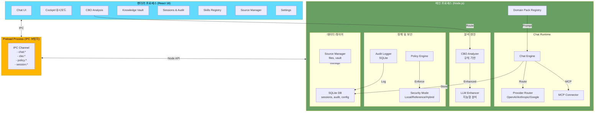

# SAP Assistant Desktop Platform

[](https://github.com/boxlogodev/sap-assistant-desktop/releases/tag/v4.0.0)
[](./LICENSE)
[](#)
[](#)
[](https://www.boxlogodev.com)

**SAP 운영 자동화 봇 플랫폼** – 로컬 우선(Local-First) 아키텍처로 민감한 데이터를 보호하면서, 커스텀 에이전트와 스킬을 통해 SAP 운영 워크플로우를 자동화합니다.

> 궁극적 비전: 사용자가 직접 정의한 워크플로우를 기반으로, SAP 운영의 수동 작업을 점진적으로 자동화하는 **몰트봇(MoltBot)** 플랫폼

---

## 주요 기능

### 다중 LLM 채팅
- **OpenAI**: GPT-4.1, GPT-4.1 Mini, GPT-4o, o4-mini
- **Anthropic**: Claude Sonnet 4.6, Claude Opus 4.6, Claude Haiku 4.5
- **Google**: Gemini 2.5 Flash, Gemini 2.5 Pro
- 프로바이더 선택, API 키 관리, 세션 저장

### CBO Impact 분석
- 텍스트 기반 CBO(Custom Business Object) 변경 분석
- 규칙 기반 + LLM 강화 분석
- `.txt`, `.md` 형식 지원
- 위험도 평가 및 개선 권고

### 3가지 보안 모드
| 모드 | 특징 | 용도 |
|------|------|------|
| **Secure Local** | 외부 전송 차단, 로컬 규칙 분석만 | 최대 보안 필요 환경 |
| **Reference** | 공개 지식만 외부 API 호출 | 표준 SAP 지식 질의 |
| **Hybrid Approved** | 승인된 요약본만 전송 | 기업 정책 준수 |

### 5가지 도메인 팩
| 팩 | 주요 T-Code | 용도 |
|----|-----------|----|
| **Ops Pack** | ST22, SM21, ST03N, STMS, SE03 | SAP 운영, 시스템 관리 |
| **Functional** | VL01N, ME21N, VF01, FC00 | 업무 프로세스 지원 |
| **CBO Maintenance** | SE80, SE91 | 커스터마이징 분석 |
| **PI Integration** | SXMB_MONI, ID_OWNR | PI/PO, Cloud Integration |
| **BTP/RAP/CAP** | ADT, SBPA | SAP BTP, 모던 개발 |

### 지식 관리 (Knowledge Vault)
- 기밀(Confidential) / 참고(Reference) 분류
- 소스 관리 및 버전 관리
- 정책 기반 접근 제어

### 세션 관리
- 채팅 이력 저장 및 복구
- 할 일(Todo) 상태, 라벨, 플래그
- 세션 아카이빙

### 감사 및 정책
- 모든 상호작용 로깅
- 정책 엔진 기반 규칙 집행
- 외부 전송 승인 흐름

### MCP 서버 연결
- Model Context Protocol 지원
- 확장 가능한 도구 생태계

### T-Code 기반 스킬 시스템
- SAP 트랜잭션별 컨텍스트 인식
- 도메인별 프롬프트 최적화

### 커스텀 에이전트 & 스킬 (v4.0 NEW)
- **agent.md**: YAML frontmatter 형식으로 워크플로우 직접 정의
- **skill.md**: 맞춤형 프롬프트 템플릿 정의
- 프리셋 에이전트/스킬과 자동 병합
- 폼 기반 비주얼 에디터 + 미리보기
- 저장 경로: `%APPDATA%/SAP Assistant/agents/` 및 `skills/`
- 상세: [커스텀 에이전트 가이드](./docs/USER-GUIDE/CUSTOM-AGENTS.md) | [커스텀 스킬 가이드](./docs/USER-GUIDE/CUSTOM-SKILLS.md)

### 코드 랩 (Code Lab) (v4.0 NEW)
- 소스 관리 + CBO 분석 + 아카이브를 하나의 통합 뷰로 제공
- 탭 전환으로 빠르게 작업 컨텍스트 전환

---

## 문서

| 문서 | 설명 |
|------|------|
| [ARCHITECTURE.md](./docs/ARCHITECTURE.md) | 시스템 아키텍처, 신뢰 경계, Mermaid 다이어그램 |
| [GETTING-STARTED.md](./docs/GETTING-STARTED.md) | 설치, 빌드, 개발 모드 |
| [CUSTOM-AGENTS.md](./docs/USER-GUIDE/CUSTOM-AGENTS.md) | agent.md 작성 가이드 + 예제 |
| [CUSTOM-SKILLS.md](./docs/USER-GUIDE/CUSTOM-SKILLS.md) | skill.md 작성 가이드 + 예제 |
| [DOMAIN-PACKS.md](./docs/USER-GUIDE/DOMAIN-PACKS.md) | 5가지 Domain Pack 상세 |
| [SECURITY-MODES.md](./docs/USER-GUIDE/SECURITY-MODES.md) | 3가지 보안 모드 설명 |
| [IPC-PROTOCOL.md](./docs/API/IPC-PROTOCOL.md) | 전체 IPC 채널 레퍼런스 |
| [CONTRIBUTING.md](./docs/CONTRIBUTING.md) | 코드 기여, 컨벤션, PR 규칙 |

---

## 아키텍처

### 시스템 다이어그램



### 데이터 흐름

1. **사용자 입력** → Renderer (React)
2. **IPC 메시지** → Preload (브릿지)
3. **메인 프로세스 처리**:
   - 보안 정책 검증
   - 도메인팩 선택
   - 프로바이더 라우팅
   - 로컬 분석 (필요시)
4. **응답 저장** → SQLite
5. **UI 업데이트** → Renderer

### 저장소 구조

```
src/
├── main/
│   ├── index.ts                    # 앱 진입점
│   ├── window.ts                   # Electron 윈도우 관리
│   ├── preload.ts                  # IPC 프리로드 스크립트
│   ├── runtime/
│   │   ├── chat-engine.ts          # 채팅 엔진
│   │   ├── provider-router.ts      # 프로바이더 라우팅
│   │   ├── mcp-connector.ts        # MCP 클라이언트
│   │   └── cbo-analyzer.ts         # CBO 분석 엔진
│   ├── security/
│   │   ├── policy-engine.ts        # 정책 엔진
│   │   ├── security-mode.ts        # 보안 모드 전환
│   │   └── audit-logger.ts         # 감사 로거
│   ├── data/
│   │   ├── db.ts                   # SQLite 초기화
│   │   ├── session-store.ts        # 세션 저장소
│   │   └── source-manager.ts       # 소스 파일 관리
│   ├── domain/
│   │   ├── domain-packs.ts         # 도메인팩 레지스트리
│   │   └── skills.ts               # T-Code 스킬 시스템
│   └── utils/
│       ├── logger.ts               # Pino 로거
│       └── constants.ts            # 상수 정의
├── renderer/
│   ├── App.tsx                     # 루트 컴포넌트
│   ├── pages/
│   │   ├── Chat.tsx                # 채팅 페이지
│   │   ├── Cockpit.tsx             # 대시보드
│   │   ├── CBO.tsx                 # CBO 분석
│   │   ├── Vault.tsx               # Knowledge Vault
│   │   ├── Sessions.tsx            # 세션/감사
│   │   ├── Skills.tsx              # 스킬 관리
│   │   ├── Sources.tsx             # 소스 관리
│   │   └── Settings.tsx            # 설정
│   ├── components/
│   │   ├── ChatMessage.tsx         # 채팅 메시지
│   │   ├── ProviderSelect.tsx      # 프로바이더 선택
│   │   ├── SecurityModeToggle.tsx  # 보안 모드 토글
│   │   ├── DomainPackLauncher.tsx  # 도메인팩 런처
│   │   └── AuditLog.tsx            # 감사 로그 뷰어
│   ├── hooks/
│   │   ├── useChat.ts              # 채팅 상태 관리
│   │   ├── useSession.ts           # 세션 관리
│   │   └── useIPC.ts               # IPC 통신
│   ├── stores/
│   │   ├── chat-store.ts           # Zustand: 채팅 상태
│   │   ├── session-store.ts        # Zustand: 세션 상태
│   │   └── auth-store.ts           # Zustand: 인증
│   └── styles/
│       ├── globals.css             # 전역 스타일
│       └── components.css          # 컴포넌트 스타일
└── shared/
    ├── types/
    │   ├── chat.ts                 # Chat 타입
    │   ├── cbo.ts                  # CBO 타입
    │   ├── policy.ts               # Policy 타입
    │   └── ipc.ts                  # IPC 메시지 타입
    └── constants/
        ├── models.ts               # 모델 상수
        ├── providers.ts            # 프로바이더 상수
        └── tcode-map.ts            # T-Code 매핑
```

---

## 기술 스택

| 계층 | 기술 | 버전 |
|------|------|------|
| **전자** | Electron | 31.x |
| **프론트엔드** | React | 18.x |
| **상태 관리** | Zustand | 5.x |
| **데이터 페칭** | React Query | 5.x |
| **언어** | TypeScript | 5.7 |
| **번들러** | Vite | 6.x |
| **백엔드** | Node.js | 22.x LTS |
| **데이터베이스** | better-sqlite3 | 11.x |
| **로깅** | Pino | 8.x |
| **LLM SDK** | Model Context Protocol | 1.27.x |
| **UI 스타일** | CSS/Tailwind (선택) | - |
| **테스트** | Vitest + Jest | - |

---

## 빠른 시작

### 필수 요구사항

- **Node.js** 22.22.1 LTS 권장 (`.nvmrc`, `.node-version` 제공)
- **npm** 10.9.4 이상
- **Windows** 10 이상 (Electron 31 호환)
- **메모리**: 최소 4GB RAM
- **디스크**: 설치 후 최소 500MB 여유 공간

### 1단계: 설치

```bash
# 저장소 클론
git clone https://github.com/boxlogodev/sap-assistant-desktop.git
cd sap-assistant-desktop/desktop

# 런타임 확인
npm run check:runtime

# 의존성 설치 (Electron 네이티브 모듈 자동 재빌드 포함)
npm install
```

### 2단계: 환경 설정

```bash
# .env 파일 생성
cp .env.example .env

# .env 파일 편집 (API 키 입력)
# OPENAI_API_KEY=sk-...
# ANTHROPIC_API_KEY=sk-ant-...
# GOOGLE_API_KEY=...
```

### 3단계: 앱 실행

```bash
# 권장: 렌더러를 먼저 빌드한 뒤 앱 실행
npm run build
npm run start
```

> `npm run start`는 Electron과 충돌할 수 있는 `NODE_OPTIONS`를 정리한 뒤 앱을 실행합니다.

### 4단계: 빌드 및 배포

```bash
# 프로덕션 빌드
npm run build

# 앱 시작 (빌드 후)
npm run start

# Windows 배포
# 1. 포터블 실행 파일 (exe 단일 파일)
npm run dist:portable

# 2. NSIS 설치 프로그램
npm run dist:nsis

# 또는 모든 배포 포맷
npm run dist
```

---

## 설정 (.env)

### 필수 환경 변수

```env
# LLM 프로바이더 API 키
OPENAI_API_KEY=sk-...
ANTHROPIC_API_KEY=sk-ant-...
GOOGLE_API_KEY=...

# 애플리케이션
APP_NAME=SAP Assistant
APP_VERSION=4.0.0

# 개발/프로덕션
NODE_ENV=development|production

# 데이터베이스
DB_PATH=./data/app.db

# 로깅
LOG_LEVEL=debug|info|warn|error
```

### 선택 환경 변수

```env
# MCP 서버 연결
MCP_SERVER_URL=http://localhost:3000
MCP_API_KEY=...

# OAuth 설정 (향후)
OAUTH_CLIENT_ID=...
OAUTH_CLIENT_SECRET=...

# 프록시 (기업 환경)
HTTP_PROXY=http://proxy:port
HTTPS_PROXY=https://proxy:port
```

자세한 설정은 [`.env.example`](./.env.example)을 참조하세요.

---

## 사용 가이드

### 1단계: 보안 모드 선택

**Settings** > **Security** 에서 모드 선택:

- **Secure Local** (기본값): 로컬 PC에서만 처리, 외부 전송 차단
- **Reference**: 표준 SAP 지식 질의, 공개 LLM 모델 사용
- **Hybrid Approved**: 승인된 요약본만 외부 전송

### 2단계: 도메인팩 선택

**Chat** 페이지에서 상황에 맞는 팩 선택:

```
Ask SAP
├─ Ops Pack           → 운영/시스템 관리 질문
├─ Functional Pack    → 업무 프로세스 지원
├─ CBO Maintenance    → CBO 변경 분석
├─ PI Integration     → 통합/연동 질문
└─ BTP/RAP/CAP       → 모던 SAP 개발
```

### 3단계: 채팅 또는 분석

#### 채팅 모드
1. 질문 입력 또는 업로드된 문서 첨부
2. 프로바이더/모델 선택
3. 응답 수신 및 세션 저장

#### CBO 분석 모드
1. **CBO Analysis** 페이지 접속
2. `.txt` 또는 `.md` 파일 업로드
3. 분석 유형 선택:
   - **규칙 기반**: 로컬 검사만 (빠름)
   - **LLM 강화**: + AI 분석 (상세)
4. 결과 확인 및 권고사항 검토

### 4단계: Knowledge Vault 관리

**Knowledge Vault** 페이지:

- **Reference**: 공개 자료 (SAP 문서, 블로그, 포럼)
- **Confidential**: 기업 내부 자료 (정책, 아키텍처)

파일 업로드 → 자동 분류 → 검색 가능

### 5단계: 세션 및 감사

**Sessions & Audit** 페이지:

- 과거 대화 복구
- 감시 로그 조회 (타임스탬프, 모델, 비용)
- 세션 아카이빙
- 정책 위반 추적

---

## 도메인 팩 상세

### Ops Pack

**목적**: SAP 시스템 운영, 성능, 보안 지원

**주요 T-Code**:
- `ST22` – 단기 덤프 분석
- `SM21` – 시스템 로그
- `ST03N` – 워크로드 분석
- `STMS` – 수송 관리
- `SE03` – 변경 관리
- `SM50` – 프로세스 모니터링
- `SM37` – 배치 작업 모니터링

**사용 시나리오**:
- 시스템 성능 저하 진단
- 에러 덤프 해석
- 배치 작업 실패 원인 분석
- 사용자 권한 설정

### Functional Pack

**목적**: 업무 프로세스 및 표준 기능 지원

**주요 T-Code**:
- `VL01N` – 배송 생성
- `VL02N` – 배송 변경
- `VF01` – 청구서 생성
- `ME21N` – 구매 발주
- `VD01` – 고객 마스터
- `FC00` – 재무 대시보드

**사용 시나리오**:
- T-Code 업무 흐름 설명
- 마스터 데이터 관리 절차
- 오류 메시지 해석
- 업무 절차 최적화

### CBO Maintenance Pack

**목적**: 커스터마이징 객체(CBO) 변경 분석 및 위험 평가

**주요 T-Code**:
- `SE80` – ABAP 개발 워크벤치
- `SE91` – 메시지 유지보수
- `SE38` – 프로그램 에디터
- `SMOD` – 확장 포인트

**입력 형식**: `.txt` 또는 `.md` (CBO 정의, 코드 변경)

**분석 결과**:
- 규칙 기반 위험도 평가
- 성능 영향 예측
- 의존성 분석
- 권고사항

### PI Integration Pack

**목적**: SAP PI/PO 및 Cloud Integration 지원

**주요 T-Code**:
- `SXMB_MONI` – 메시지 모니터링
- `SXMB_IFR` – Integration Builder
- `ID_OWNR` – Integration Directory
- `PIIS` – PI Integration Suite

**사용 시나리오**:
- 메시지 흐름 설계
- 통합 오류 진단
- 매핑 및 변환 검토
- 클라우드 통합 아키텍처

### BTP/RAP/CAP Pack

**목적**: SAP BTP, ABAP RESTful Application Programming(RAP), Cloud Application Programming(CAP) 개발 지원

**주요 T-Code** / **도구**:
- `ADT` – ABAP Development Tools (Eclipse)
- `SBPA` – BTP Admin 콘솔
- `FIORI` – Fiori 앱 런처
- SAP Build Work Zone

**사용 시나리오**:
- 클라우드 앱 개발 모범 사례
- RAP 엔티티 설계
- CAP 프로젝트 구조
- BTP 서비스 통합

---

## 보안 모델

### Secure Local Mode (로컬 보안 모드)

```
┌─────────────────────────────────────┐
│ 사용자 입력 (질문/파일)              │
└────────────┬────────────────────────┘
             │
             ▼
┌─────────────────────────────────────┐
│ 정책 엔진: "외부 전송 가능?"          │
│ → 판정: NO                           │
└────────────┬────────────────────────┘
             │
             ▼
┌─────────────────────────────────────┐
│ 로컬 분석만 실행:                    │
│ • CBO 규칙 기반 분석                 │
│ • 정규표현식 패턴 매칭              │
│ • 로컬 Knowledge 검색               │
└────────────┬────────────────────────┘
             │
             ▼
┌─────────────────────────────────────┐
│ 결과 반환 (외부 API 호출 불가)      │
└─────────────────────────────────────┘
```

**특징**:
- 모든 처리가 로컬 PC에서 진행
- 인터넷 연결 불필요
- 외부 서버 전송 차단
- 민감 데이터 유출 불가능

### Reference Mode (참고 모드)

```
┌──────────────────────────────────────┐
│ 사용자 입력 (공개 지식 질문)          │
└────────────┬─────────────────────────┘
             │
             ▼
┌──────────────────────────────────────┐
│ 정책 엔진: "공개 정보만 포함?"       │
│ → 판정: YES                          │
└────────────┬─────────────────────────┘
             │
             ▼
┌──────────────────────────────────────┐
│ 선택된 프로바이더로 라우팅:          │
│ • OpenAI GPT-4o                      │
│ • Anthropic Claude Opus              │
│ • Google Gemini 2.5                  │
└────────────┬─────────────────────────┘
             │
             ▼
┌──────────────────────────────────────┐
│ 로컬 + 외부 LLM 분석                 │
│ (공개 컨텍스트만 전송)               │
└────────────┬─────────────────────────┘
             │
             ▼
┌──────────────────────────────────────┐
│ 결과 반환 및 로깅                    │
└──────────────────────────────────────┘
```

**특징**:
- 표준 SAP 지식만 외부 전송
- API 키 기반 인증
- 기업 정책 설정 가능
- 감시 로그 기록

### Hybrid Approved Mode (하이브리드 승인 모드)

```
┌───────────────────────────────────────┐
│ 사용자 입력 (민감할 수 있는 질문)    │
└────────────┬──────────────────────────┘
             │
             ▼
┌───────────────────────────────────────┐
│ 민감성 스캔:                          │
│ • 회사명, 부서, 개인정보 제거        │
│ • 기밀 정보 마스킹                   │
└────────────┬──────────────────────────┘
             │
             ▼
┌───────────────────────────────────────┐
│ 승인 프로세스:                        │
│ ✓ 자동 승인 (정책 기준)              │
│ ✓ 관리자 승인 필요 (위험도 높음)     │
└────────────┬──────────────────────────┘
             │
             ▼
┌───────────────────────────────────────┐
│ 승인된 요약본만 외부 LLM 전송        │
│ (원문 소스는 로컬에만 유지)          │
└────────────┬──────────────────────────┘
             │
             ▼
┌───────────────────────────────────────┐
│ 결과 반환 및 감시 로그 기록          │
│ (승인 기록 포함)                     │
└───────────────────────────────────────┘
```

**특징**:
- 민감정보 자동 탐지 및 제거
- 승인 워크플로우 (자동/수동)
- 기업 정책 준수
- 완전한 감시 추적

---

## npm 스크립트

```bash
# 개발
npm run check:runtime    # Node/npm 런타임 확인
npm run dev              # 메인 프로세스 개발 실행 (tsx)
npm run build:renderer   # React 빌드 (Vite)
npm run build:main      # Electron Main 빌드

# 프로덕션 빌드
npm run build           # build:main + build:renderer
npm run start           # 빌드된 앱 실행 (충돌하는 NODE_OPTIONS 자동 정리)

# 패키징
npm run pack            # 앱 패킹 (dist/ 생성)
npm run dist            # 모든 설치 관계자 생성
npm run dist:portable   # 포터블 EXE (exe 단일 파일)
npm run dist:nsis       # NSIS 설치 프로그램 (msi)

# 검증
npm run lint            # ESLint 린트
npm run typecheck       # TypeScript 타입 체크
npm run test            # 테스트 스위트 (감시 모드)
npm run test:run        # 테스트 한 번 실행
npm run test:coverage   # 커버리지 리포트
npm run verify          # lint + typecheck + test:run 순서 실행
```

---

## 보안 정책

### 민감 파일 보호

**절대 커밋하지 말 것**:
- `.env`, `.env.local` (API 키)
- `data/` (사용자 데이터)
- `dist/` (빌드 산출물)
- `node_modules/`

**확인 항목**:
- `.gitignore` 설정 확인
- `.env.example` 사용 (예시만)
- GitHub Secrets 사용 (CI/CD)

### API 키 관리

1. **로컬 개발**:
   ```bash
   # .env 파일 (git 무시됨)
   OPENAI_API_KEY=sk-...
   ANTHROPIC_API_KEY=sk-ant-...
   ```

2. **프로덕션 배포**:
   - 환경 변수를 통해 제공
   - 난독화 또는 보안 저장소 사용

### 데이터 암호화

- SQLite 데이터베이스: 암호화되지 않음 (로컬 저장)
- 네트워크 전송: HTTPS 전송만 (LLM API)
- 파일 저장: 관리자 권한 필요

---

## 기여 가이드

### 브랜치 전략 (Git Flow)

```
main (프로덕션)
  ↑
develop (개발 통합)
  ↑
feature/* (기능 개발)
  ↑
hotfix/* (긴급 버그)
```

### 커밋 메시지 규칙

**Conventional Commits** 사용:

```
feat(도메인): 간단한 설명
fix(도메인): 버그 설명
refactor(도메인): 리팩토링 설명
docs: 문서 업데이트
test: 테스트 추가
chore: 빌드, 의존성 등

예시:
feat(chat): OpenAI 스트리밍 지원 추가
fix(cbo): 규칙 분석 엣지 케이스 수정
docs(readme): 빠른 시작 가이드 추가
```

### Pull Request 프로세스

1. **포크 및 브랜치 생성**:
   ```bash
   git checkout -b feature/my-feature develop
   ```

2. **코드 작성 및 커밋**:
   ```bash
   git add .
   git commit -m "feat(domain): description"
   ```

3. **검증**:
   ```bash
   npm run verify       # lint + typecheck + test
   ```

4. **푸시 및 PR**:
   ```bash
   git push origin feature/my-feature
   # GitHub에서 PR 생성 (develop 대상)
   ```

5. **PR 체크리스트**:
   - [ ] 테스트 작성/수정
   - [ ] 타입 체크 통과
   - [ ] 린트 통과
   - [ ] 문서 업데이트
   - [ ] Co-Authored-By 헤더 포함

### 테스트

```bash
# 테스트 작성 (Jest/Vitest)
# __tests__/ 또는 .test.ts 파일

# 테스트 실행
npm run test            # 감시 모드
npm run test:run        # 한 번 실행
npm run test:coverage   # 커버리지 리포트

# 최소 커버리지: 70% (src/)
```

### 코드 스타일

- **TypeScript** strict mode 필수
- **Prettier** 자동 포맷팅
- **ESLint** 린트 규칙 준수
- 함수형 프로그래밍 선호 (불변성, 순수함수)

---

## 문제 해결

### 일반 문제

#### 앱이 실행되지 않음
```bash
# 1. 의존성 재설치
rm -rf node_modules package-lock.json
npm install

# 2. 캐시 삭제
npm run clean
npm install

# 3. 포트 충돌 확인 (기본: 3000, 5173)
lsof -i :3000
```

#### 빌드 실패
```bash
# 1. 환경 확인
node --version  # v18+ 필요
npm --version   # 9+ 필요

# 2. 의존성 업데이트
npm update

# 3. 캐시 삭제
npm cache clean --force
npm install
```

#### 데이터베이스 오류
```bash
# 1. DB 파일 확인
ls -la ./data/app.db

# 2. 권한 확인
chmod 644 ./data/app.db

# 3. 초기화 (데이터 손실!)
rm ./data/app.db
npm run dev  # 자동 재생성
```

### LLM API 문제

#### API 키 인증 실패
```bash
# 1. .env 파일 확인
cat .env | grep API_KEY

# 2. API 제공자 대시보드 확인
# OpenAI: https://platform.openai.com/account/api-keys
# Anthropic: https://console.anthropic.com/account/keys
# Google: https://console.cloud.google.com/

# 3. API 할당량 확인
# 초과 시: 빌링 정보 업데이트 필요
```

#### 느린 응답
```bash
# 1. 모델 확인
# GPT-4.1 > Claude Opus > Gemini (속도 순)

# 2. 프로바이더 지역 확인
# US 리전이 권장됨

# 3. 네트워크 지연 확인
ping api.openai.com
```

### 성능 최적화

```bash
# 1. 메모리 사용량 확인
npm run dev  # DevTools 열기 (F12)

# 2. 번들 크기 분석
npx webpack-bundle-analyzer

# 3. SQLite 최적화
# 정기적으로 VACUUM 실행 (Settings > Database)
```

---

## 라이선스

[MIT License](./LICENSE) – 자유로운 사용, 수정, 배포 가능

**조건**:
- 라이선스 및 저작권 표시 유지
- 책임 부인 포함

---

## 참고 자료

### 공식 문서
- [Electron 문서](https://www.electronjs.org/docs)
- [React 18 가이드](https://react.dev)
- [TypeScript 핸드북](https://www.typescriptlang.org/docs/)
- [Vite 가이드](https://vitejs.dev)

### SAP 자료
- [SAP Help Portal](https://help.sap.com)
- [SAP BTP 문서](https://help.sap.com/docs/btp)
- [ABAP Development 가이드](https://help.sap.com/docs/abap-development)

### 커뮤니티
- [GitHub Discussions](https://github.com/boxlogodev/sap-assistant-desktop/discussions)
- [SAP 커뮤니티](https://community.sap.com)
- [Stack Overflow - SAP](https://stackoverflow.com/questions/tagged/sap)

---

## 로드맵

### Phase 1: 수동 워크플로우 (v4.0 — 현재)
- ✅ 다중 LLM 통합 (OpenAI, Anthropic, Google)
- ✅ CBO 분석 + 소스코드 아카이브
- ✅ 에이전트/스킬 시스템 (프리셋 2 에이전트, 6 스킬)
- ✅ **커스텀 에이전트/스킬** (agent.md / skill.md)
- ✅ **코드 랩** (Sources + CBO + Archive 통합)
- ✅ Knowledge Vault + MCP 서버 연결
- ✅ Cockpit (마감 관리 + 루틴)

### Phase 2: 자동 트리거 (v4.1 — 예정)
- ⬜ 스케줄 기반 에이전트 실행 (cron-like)
- ⬜ 이벤트 트리거 (파일 변경 감시, Transport 알림)
- ⬜ 에이전트 체이닝 (에이전트 → 에이전트)
- ⬜ 결과 알림 (Windows 토스트, Slack webhook)

### Phase 3: 무인 운영 (v5.0 — 장기)
- ⬜ SAP 시스템 직접 연결 (RFC/OData)
- ⬜ 자동 Transport 리뷰 & 승인 흐름
- ⬜ 멀티 시스템 모니터링 대시보드
- ⬜ 오프라인 LLM (Ollama 연동)
- ⬜ 엔터프라이즈 배포 (LDAP, SSO, 코드 서명)

---

## 문의 및 지원

### 버그 신고
- [GitHub Issues](https://github.com/boxlogodev/sap-assistant-desktop/issues)
- 템플릿: `[BUG] 제목` 또는 `[FEATURE] 제목`

### 토론
- [GitHub Discussions](https://github.com/boxlogodev/sap-assistant-desktop/discussions)

### 이메일
- support@your-org.com

---

**Made with ❤️ for SAP Professionals**

© 2024 Your Organization. All rights reserved.
