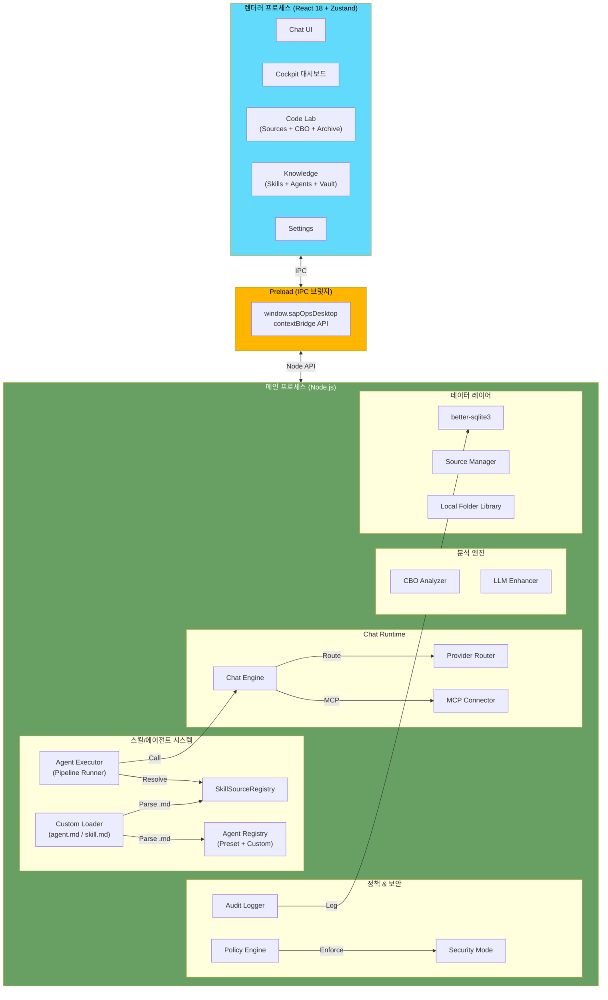
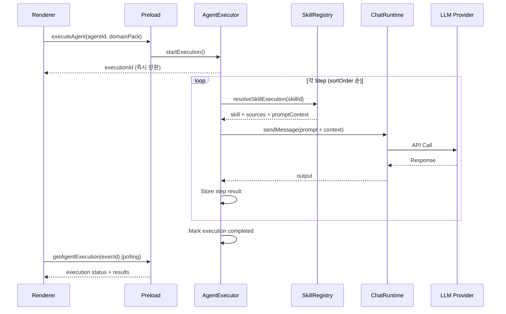

# SAP Assistant Desktop Platform — Architecture

## Overview

SAP Assistant Desktop Platform은 **Electron 31 + React 18 + TypeScript** 기반의 로컬 우선(Local-First) 데스크톱 앱입니다. 민감한 SAP 운영 데이터를 로컬에 보관하면서 다중 LLM(OpenAI, Anthropic, Google)을 활용한 지능형 운영 지원을 제공합니다.

---

## 시스템 다이어그램



---

## 신뢰 경계 (Trust Boundary)

| 경계 | 설명 |
|------|------|
| **Renderer → Preload** | `contextBridge.exposeInMainWorld`로 노출된 API만 사용 |
| **Preload → Main** | `ipcRenderer.invoke` → `ipcMain.handle` 채널 기반 통신 |
| **Main → 외부** | 보안 모드(Secure Local/Reference/Hybrid)에 따라 외부 API 호출 제한 |
| **Custom Files → Runtime** | `gray-matter`로 YAML frontmatter 파싱, 스키마 검증 후 로드 |

### 보안 원칙
- Renderer에서 Node.js 직접 접근 불가
- 자격증명은 시스템 키체인(keytar) 저장
- SQLite 쿼리는 항상 바인딩 변수 사용
- 커스텀 agent.md/skill.md는 프롬프트 템플릿만 포함, 코드 실행 불가

---

## 프로세스 구조

### Main Process
- Electron 앱 진입점 (`src/main/index.ts`)
- IPC 핸들러 등록 (`src/main/ipc/`)
- SQLite 데이터베이스 관리
- LLM 프로바이더 라우팅
- 에이전트 파이프라인 실행

### Preload Process
- `contextBridge`를 통한 IPC 브릿지 (`src/preload/index.ts`)
- `window.sapOpsDesktop` API 노출 (100+ 메서드)

### Renderer Process
- React 18 SPA (`src/renderer/`)
- Zustand 상태 관리 + React Query 데이터 페칭
- CSS 변수 기반 디자인 시스템

---

## 데이터 흐름

### Agent 실행 파이프라인



---

## 디렉토리 구조

```
src/
├── main/                          # Electron 메인 프로세스
│   ├── agents/                    # 에이전트 시스템
│   │   ├── registry.ts            # 프리셋 에이전트 정의
│   │   ├── executor.ts            # 파이프라인 실행기
│   │   ├── agentFileParser.ts     # agent.md 파싱
│   │   └── agentLoaderService.ts  # 파일 시스템 로더
│   ├── skills/                    # 스킬 시스템
│   │   ├── registry.ts            # SkillSourceRegistry + 프리셋 스킬
│   │   ├── skillFileParser.ts     # skill.md 파싱
│   │   └── skillLoaderService.ts  # 파일 시스템 로더
│   ├── ipc/                       # IPC 핸들러
│   ├── types/                     # 타입 정의
│   ├── policy/                    # 정책 엔진
│   ├── providers/                 # LLM 프로바이더
│   ├── cbo/                       # CBO 분석
│   ├── sources/                   # 소스 관리
│   ├── storage/                   # SQLite 저장소
│   └── auth/                      # 인증 (OAuth, keytar)
├── preload/                       # IPC 브릿지
│   └── index.ts
└── renderer/                      # React UI
    ├── pages/
    │   ├── sap-assistant/         # SAP Assistant 모드
    │   │   ├── ChatMode.tsx
    │   │   ├── AnalysisMode.tsx
    │   │   ├── ArchiveMode.tsx
    │   │   └── CodeLabMode.tsx    # 통합 코드 랩
    │   └── knowledge/             # Knowledge 허브
    │       ├── AgentsCatalog.tsx
    │       ├── SkillsCatalog.tsx
    │       ├── AgentEditor.tsx    # 커스텀 에이전트 편집
    │       └── SkillEditor.tsx    # 커스텀 스킬 편집
    ├── stores/                    # Zustand 상태
    └── components/                # 공통 컴포넌트
```

---

## 기술 스택 요약

| 계층 | 기술 | 역할 |
|------|------|------|
| Runtime | Electron 31 | 데스크톱 앱 프레임워크 |
| Frontend | React 18 + TypeScript 5.7 | UI 렌더링 |
| State | Zustand 5 + React Query 5 | 상태 관리 + 서버 상태 |
| Database | better-sqlite3 | 로컬 데이터 저장 |
| Auth | keytar | 시스템 키체인 자격증명 |
| LLM | OpenAI / Anthropic / Google | 다중 프로바이더 |
| Protocol | MCP SDK 1.27 | 도구 확장 |
| Parsing | gray-matter | YAML frontmatter 파싱 |
| Build | Vite 6 | 번들링 |
| Test | Vitest | 테스트 |
